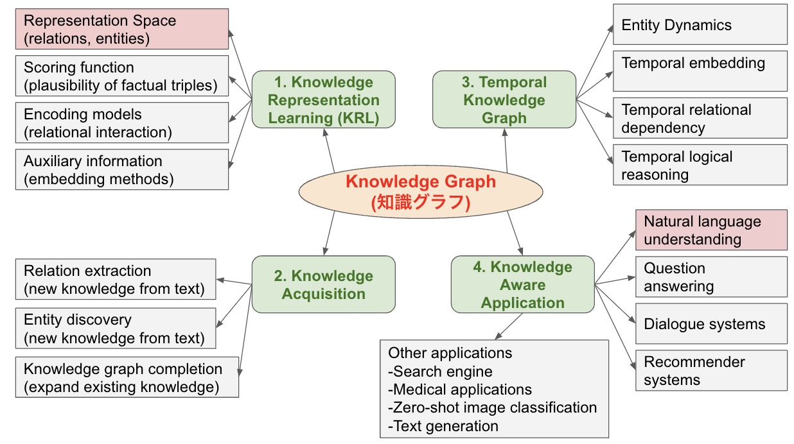

# Knowledge Graph(KnoGra)

ナレッジをグラフ図の形式で残す、方向性の策定とかツールの案
- 残し方
- 活用の仕方
Knoredge Graphの元になるデータの雛形(knodat)を定義して、
それに基づいたKnoredge Graph(knogra)の学習と形式、利用のためのツールを作りたい。

## 想定構造
```sh
knogra/  
|- __init__.py
|- knodat.py  # loaderも兼ねる？
| |- class data()  
|- knogra.py  
| |- class graph()
|- utils.py
```

## Reference

- [知識グラフの紹介：CausalNexで因果推論を試してみたい](https://recruit.gmo.jp/engineer/jisedai/blog/knowledge_graph_casual_inference/):  
    割と今までやっていたこととも関わりが深い。以下の図は参考になりそう。  
    
- [IoT時代に求められる大量データからの洞察の発見～ナレッジグラフの能力とは](https://www.ibm.com/blogs/solutions/jp-ja/manufacturing-iot-knowledge-graph/):  
    実装例が、センサーかつ異常の検知であり、観測をナレッジとして残しておいて、それを利用した提案などを行うものなので、異常検知としてやろうとしていることに近い。ヒントになりそう。
- [ナレッジグラフ推論チャレンジ](https://challenge.knowledge-graph.jp/2021/):  
    推理小説の犯人を当てるために、知識グラフを利用した推論を行うAIを作る企画。過去作品の戦略などは参考になりそう。
- [ナレッジマネジメント研修](https://www.insource.co.jp/bup/bup_knowledge_manage.html):  
    もっと一般的な話として、ナレッジを残すための研修。データ解析的なこととは直接的に関係はないと思われる。
- [情報システム障害解析のための知識グラフ構築の試み(NTT)](https://www.slideshare.net/slideshow/embed_code/key/sUFyAp6X4TI0IL):  
    実際に、ナレッジグラフを構築しようとしている。

